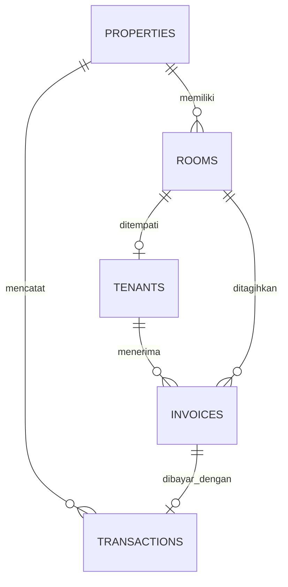

# Panduan tema dan integrasi Kos Cendana

## Tema tampilan

Tombol tema di kanan atas berjalan dalam tiga mode: **Otomatis**, **Terang**, dan **Gelap**. Klik berulang untuk berpindah mode. Pada mode Otomatis, tampilan mengikuti pengaturan siang/malam perangkat. Pilihan pengguna disimpan di browser dengan `localStorage`.

## Struktur data

Gunakan tabel `houses` sebagai relasi antara properti dan kamar untuk membedakan **Rumah 1** dan **Rumah 2**. Jangan gunakan `floor` jika kedua unit tersebut adalah bangunan terpisah.

## Cara menjalankan

1. Pasang Node.js versi 20 atau yang lebih baru.
2. Di folder proyek, jalankan `npm install`.
3. Jalankan `npm run dev` lalu buka alamat lokal yang muncul.
4. Klik tombol tema di kanan atas untuk mengecek ketiga mode tampilan.

## Menghubungkan data asli

1. Buat proyek Supabase, lalu jalankan berkas `supabase/schema.sql` pada SQL Editor.
2. Isi `.env.local` berdasarkan `.env.example`.
3. Tambahkan Rumah 1 dan Rumah 2 pada tabel `houses`, lalu hubungkan setiap kamar lewat `rooms.house_id`.
4. Ganti data contoh di `src/main.jsx` dengan pembacaan tabel Supabase.
5. Untuk penagihan, simpan satu baris `invoices` untuk setiap penyewa dan bulan. Total tunggakan didapat dari seluruh baris dengan status `unpaid` atau `overdue`.

## WhatsApp

Untuk pengiriman manual, tombol menggunakan tautan `wa.me` dengan pesan siap-kirim. Untuk pengiriman otomatis, panggil WhatsApp Cloud API dari Supabase Edge Function; jangan pernah meletakkan token WhatsApp di frontend.
